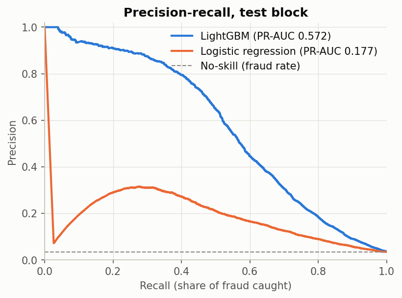
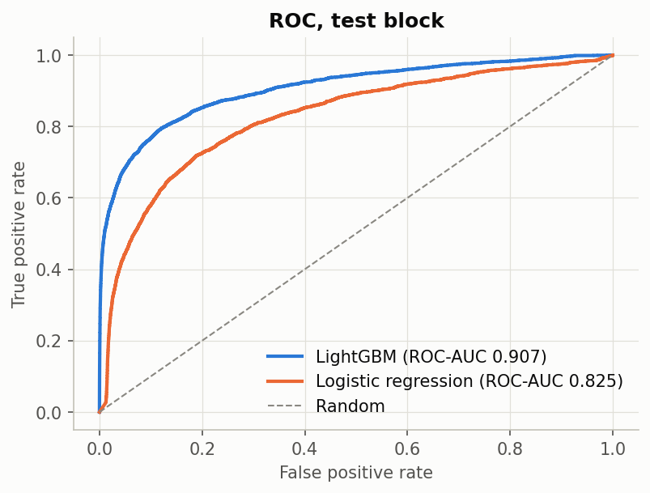
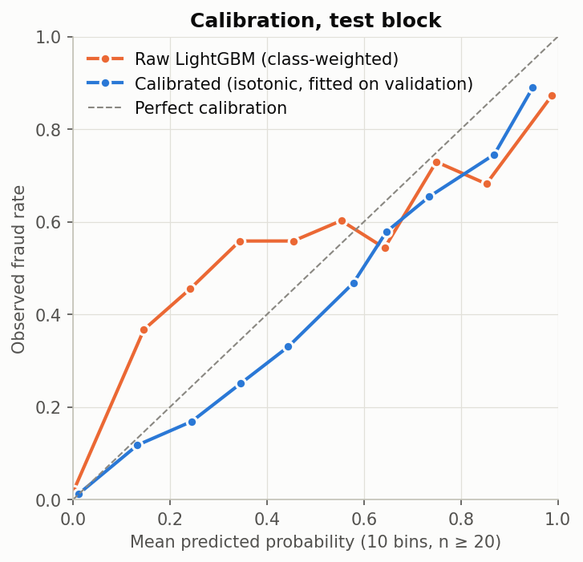
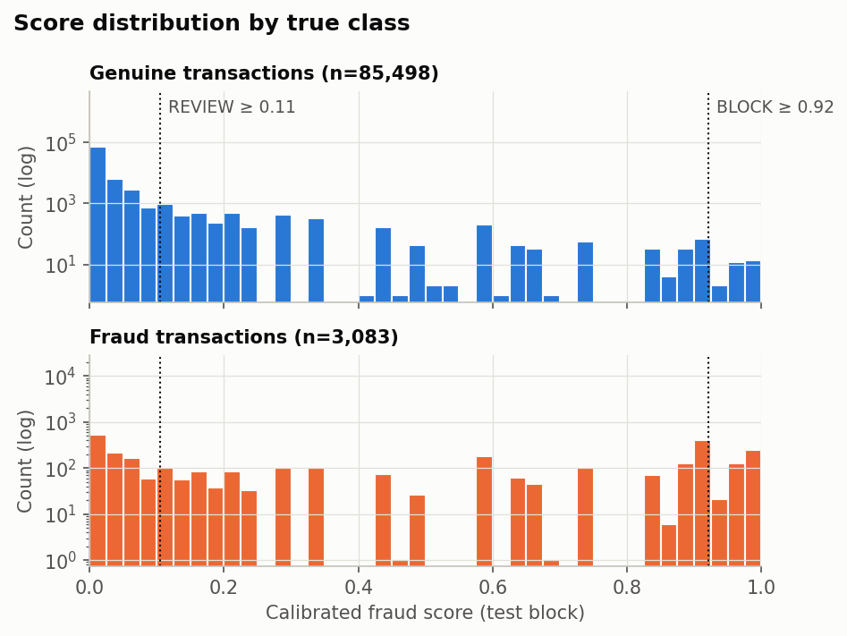
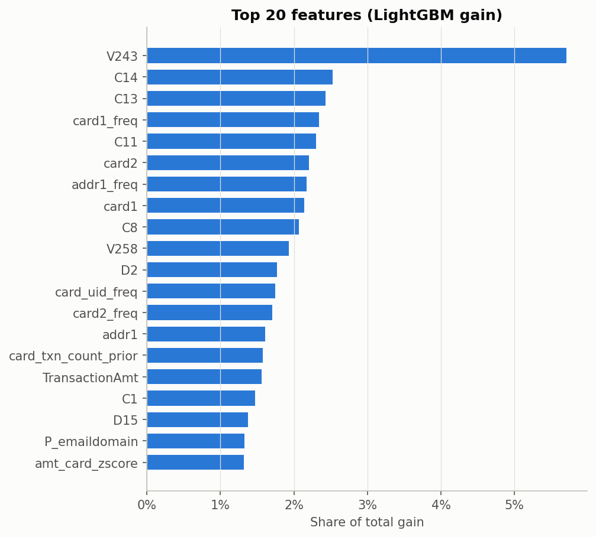

# FraudLens

[](https://github.com/kianharia30/fraudlens/actions/workflows/ci.yml)


**Cost-aware, explainable card-fraud detection.** FraudLens scores card transactions with a
calibrated LightGBM model trained on the IEEE-CIS dataset. It turns each score into an
**APPROVE / REVIEW / BLOCK** decision, using thresholds chosen to minimise expected £ cost rather
than to maximise accuracy, and explains every decision in plain English with SHAP. The model is
trained offline with leakage-safe, time-ordered validation and is served by a FastAPI endpoint.
An interactive Streamlit app shows the full decision process on held-out transactions that the
model never saw during training, tuning or threshold selection.

> Every result in this README is generated from [`docs/metrics.json`](docs/metrics.json) and
> [`docs/benchmark.json`](docs/benchmark.json) by `make train` / `make benchmark` / `make readme`.
> Nothing is hand-typed: rerun and the numbers update.

---

## Demo

Run `make app` and open http://localhost:8501. Two modes:

- **Simulation**: sample a held-out transaction (random, suspicious, normal or borderline) and watch it go step by step from raw input to features, score, decision,
  SHAP reasons and finally the true label, with a running £ tally.
- **Manual**: start from a real transaction, edit key fields ("what if the amount were 10x?"),
  and compare the previous and new scores side by side.

## Architecture

```mermaid
flowchart LR
    subgraph Offline["Offline training (make train)"]
        R[("data/raw<br/>train_transaction.csv<br/>train_identity.csv")] --> L["Load + left-join<br/>float32 / category dtypes"]
        L --> F["Past-only behaviour features<br/>(proxy card UID)"]
        F --> S["Time split<br/>70% train / 15% valid / 15% test"]
        S -->|train| P["FeaturePipeline.fit<br/>sparse-drop, encoders"]
        P --> B["Logistic regression<br/>baseline"]
        P --> G["LightGBM + Optuna<br/>(PR-AUC on valid)"]
        G -->|valid| C["Isotonic calibration"]
        C -->|valid| T["Cost-optimal thresholds<br/>t_review, t_block"]
        T -->|test only| E["Metrics, £ costs,<br/>figures, demo pool"]
    end
    E --> A[("artifacts/models/&lt;version&gt;<br/>bundle + metadata.json")]
    E --> M[("docs/metrics.json<br/>docs/figures")]
    A --> SC["FraudScorer<br/>(one shared code path)"]
    SC --> API["FastAPI<br/>POST /score, /health, /model-info"]
    SC --> APP["Streamlit app<br/>Simulation, Manual, Performance"]
    M --> README["README / model card<br/>(make readme)"]
```



The API and the app import the **same** `FraudScorer` (pipeline → LightGBM → calibrator →
thresholds → SHAP reasons), so there is no duplicated scoring logic.

## Quickstart

```bash
git clone https://github.com/kianharia30/fraudlens.git && cd fraudlens
make setup            # Python 3.11 venv, pinned deps, pre-commit hooks
```

**Get the data** (not committed: Kaggle licence, ~700 MB for the two files). Accept the rules of the
[IEEE-CIS Fraud Detection competition](https://www.kaggle.com/competitions/ieee-fraud-detection/data),
download it, and put **`train_transaction.csv`** and **`train_identity.csv`** in `data/raw/`
(the `test_*` files have no labels and are not used). With a Kaggle API token you can run
`make download-data` instead. Then:

```bash
make validate-data    # checks files and schema, with instructions if anything is missing
make train            # features, splits, models, calibration, thresholds, figures, README numbers
make app              # http://localhost:8501
make serve            # http://localhost:8000/docs (in another terminal)
make benchmark        # p50/p95/p99 latency over 1,000 requests (needs `make serve`)
```

No data yet? `make synthetic-demo` runs the whole pipeline on a small fake dataset and opens
the app on it. It is clearly flagged as synthetic, and its numbers can never reach this README.

Other targets: `make test`, `make lint`, `make thresholds` (re-tune after changing costs or
budgets), `make evaluate` (reproduce test metrics from the saved
model), `make docker` (API + app via docker compose).

## Results

<!-- RESULTS:START -->
Model `20261002-211632-nogit` · trained 2026-10-02T21:16:32+00:00 · git `nogit` · source: [`docs/metrics.json`](docs/metrics.json)

Held-out **test block**: 88,581 transactions, 3.48% fraud (never used for training, tuning, calibration or thresholds).

| Model | PR-AUC | ROC-AUC | Recall @ 90% precision | Brier (calibrated) |
|---|---|---|---|---|
| LightGBM | **0.5723** | 0.9066 | 23.2% | 0.0212 |
| Logistic regression | 0.1766 | 0.8252 | 0.0% | 0.1402 |

| Policy (test block) | Total cost | Fraud stopped | Fraud £ stopped | Genuine blocked | Genuine reviewed |
|---|---|---|---|---|---|
| Do nothing (approve all) | £469,609 | 0 / 3,083 (0.0%) | £0 | 0 | 0 |
| Logistic regression | £291,038 | 1,498 / 3,083 (48.6%) | £195,496 | 1,356 | 4,014 |
| LightGBM | £181,782 | 2,079 / 3,083 (67.4%) | £298,799 | 58 | 3,865 |

The LightGBM policy sends **6.0%** of test transactions to manual review and blocks **0.7%**. Thresholds were tuned to stay within budgets of review ≤ 5% and block ≤ 1% on *validation*; on the later test period the review budget is exceeded, a sign of drift that a live system would need to monitor. PR-AUC falls from 0.668 (validation) to 0.572 (the later test period), consistent with fraud patterns drifting over time.

LightGBM thresholds (chosen on validation): **REVIEW ≥ 0.105**, **BLOCK ≥ 0.921**. Savings on the test block: **£287,827** vs doing nothing, **£109,257** vs the logistic-regression policy.

Training time: 28.0 min total (8 Optuna trials, 26.9 min) on Darwin arm64, Python 3.11.5.
<!-- RESULTS:END -->

| | |
|---|---|
|  |  |
|  |  |



Columns dropped and encodings used are listed in [`docs/DATA_REPORT.md`](docs/DATA_REPORT.md) (generated).

### API latency

<!-- BENCHMARK:START -->
1,000 requests per mode (HTTP http://localhost:8010) on Darwin arm64, Python 3.11.5; source: [`docs/benchmark.json`](docs/benchmark.json)

| `POST /score` | p50 | p95 | p99 |
|---|---|---|---|
| Server `latency_ms`, with SHAP reasons (default) | 223.92 ms | 289.78 ms | 388.8 ms |
| Client round trip, with SHAP reasons | 225.4 ms | 293.27 ms | 392.17 ms |
| Server `latency_ms`, score only (`?explain=false`) | 23.81 ms | 31.51 ms | 73.21 ms |
| Client round trip, score only | 25.09 ms | 33.46 ms | 78.94 ms |

Exact TreeSHAP over every tree dominates the explained path; scoring alone is the feature transform plus one LightGBM prediction.
<!-- BENCHMARK:END -->

```bash
curl -s localhost:8000/score -H 'content-type: application/json' -d '{
  "TransactionAmt": 249.0, "ProductCD": "C", "card4": "visa", "card6": "credit",
  "P_emaildomain": "protonmail.com", "card_txn_count_1h": 4, "amt_to_card_mean_ratio": 9.5
}' | jq '{fraud_score, decision, reasons: [.top_reasons[].text], latency_ms}'
```

## How the cost-based thresholds work

A fraud score is only useful once it becomes an action. Each outcome has a cost (all in
[`configs/config.yaml`](configs/config.yaml)):

| | Fraud | Genuine |
|---|---|---|
| **APPROVE** | lose the amount (1.0x `TransactionAmt`) | £0 |
| **REVIEW** (analyst checks it) | £2 (review assumed to catch it) | £2 |
| **BLOCK** | £0 (fraud prevented) | £5 (false alarm, unhappy customer) |

The policy is `score < t_review → APPROVE`, `t_review ≤ score < t_block → REVIEW`,
`score ≥ t_block → BLOCK`. The pair `(t_review, t_block)` is chosen by exhaustive search over a
quantile grid **on the validation block**, minimising total cost subject to two **operational
budgets** (`thresholds` in the config): at most 5% of transactions sent to analysts and at most
1% declined. Without them, a £2 review and a £5 false alarm are so cheap compared with a
missed fraud that the unconstrained optimum reviews about a quarter of all traffic, which no
team could staff. Prefix sums make each of the ~45k candidate pairs an O(1) evaluation. The chosen thresholds are then applied **unchanged** to the
held-out test block and compared, in £, with *do nothing* (approve everything) and with the
logistic-regression model given its own optimised thresholds under the same budgets.
After editing costs or budgets, `make thresholds` re-tunes on validation and refreshes every
output (bundle, metrics, figures, demo pool, README) without retraining.

Calibration matters here. `scale_pos_weight` inflates LightGBM's raw scores, so isotonic
regression (fitted on validation) maps them back to observed fraud rates. That makes the
thresholds read as real probabilities and keeps them stable if the costs change.

## Design decisions

- **Time-based split, never random.** Rows are sorted by `TransactionDT` and cut 70/15/15. Ties
  at a boundary go to the earlier block, so `max(train time) < min(valid time) < min(test time)`
  holds strictly (tested). A random split leaks future card behaviour and fraud campaigns into
  training and inflates every metric.
- **PR-AUC as the headline.** With ~3.5% fraud, approving everything is ~96.5% "accurate", so
  accuracy is not reported. ROC-AUC is reported but flatters imbalanced problems, while
  precision-recall shows the trade-off that matters. Recall at 90% precision and the £ cost tables
  make it concrete.
- **No SMOTE.** Synthetic minority samples interpolate between frauds that may be weeks apart,
  ignore the time structure and distort probabilities. Imbalance is handled with a tuned
  `scale_pos_weight`, and the score is calibrated afterwards.
- **Missing values left as NaN.** LightGBM learns a direction for missing values, and in IEEE-CIS
  missingness is itself a signal (identity columns exist only for some channels). Only the logistic
  baseline imputes medians, inside its own pipeline. Columns more than 95% missing *in the training
  block* are dropped.
- **Proxy card UID** = `card1_card2_card3_card5_addr1` (the dataset has no customer ID). Behaviour
  features (amount vs the card's expanding mean and median, z-score, 1h/24h velocity, time since
  the card's previous transaction, deviation from its usual hour, new email domain/device/billing
  region for this card) are computed in **one causal pass**. Each row sees only earlier rows.
  "New billing region" uses a coarser card key without `addr1`, because `addr1` is part of the UID.
- **Encoders fitted on train only.** Frequency maps and ordinal codes come from the training
  block. Unseen categories get a dedicated code, and unseen frequency values get 0.
- **`TransactionDT` itself is not a feature.** An absolute time index would let the model learn
  the training period's trend. Only hour-of-day and day-of-week are derived from it.
- **One scoring path.** `FraudScorer` is shared by the API, the app, the benchmark and the
  evaluation scripts. A test asserts that single-row API scores equal batch scores.
- **Reproducible.** One config file, seeds everywhere (NumPy, Optuna TPE, LightGBM with
  `deterministic=True`), pinned dependencies, and versioned bundles whose `metadata.json`
  records the data window, metrics, parameters, config and git hash. `make evaluate`
  re-scores the test block and checks the recorded metrics.

### Leakage checklist

| Risk | Prevention | Where it is checked |
|---|---|---|
| Future rows in training | chronological split, tie-safe boundaries | `tests/test_split.py` |
| Features peeking ahead | past-only expanding stats, `[t-w, t)` windows | `tests/test_features_leakage.py` (mutating or appending future rows leaves past features unchanged) |
| Encoders fitted on eval data | `FeaturePipeline.fit(train)` only | `tests/test_pipeline.py` |
| Tuning, calibration or thresholds on test | validation block only; test used once for reporting | `models/train.py` docstring and data flow |
| Demo app trained on what it shows | demo pool = test block only | `tests/test_scoring_api.py` |

## Explainability

SHAP `TreeExplainer` gives per-feature contributions in log-odds. These are grouped into
human-readable reasons, so one real-world fact gives one reason (e.g. *"Amount is 27.0x this
card's average and 30.0x its typical (median) amount"*). **Most IEEE-CIS columns are anonymised**
(V1–V339, C, D, M, most `id_*`). FraudLens does not invent meanings for them: they are summed
into groups labelled as *anonymised risk signals*. The only exceptions are `id_30`, `id_31` and
`id_33`, whose values are plainly OS, browser and screen-resolution strings. SHAP explains the
raw model output; the displayed probability is then calibrated (monotone), so the direction of
each reason is preserved.

## Project structure

```
src/fraudlens/
  config.py            typed config (pydantic), single source of settings
  data/                validation, compact loading, time split, synthetic data
  features/            behaviour.py (past-only features), pipeline.py (encoders, train-fitted)
  models/              baseline, lgbm (+Optuna), calibration, metrics, policy (costs), figures, artifacts, train
  explain/             SHAP wrapper and plain-English reasons
  scoring.py           FraudScorer, shared by API and app
  service/             FastAPI app and Pydantic schemas
  app/                 Streamlit UI; logic.py holds the tested, UI-free parts
scripts/               download, validate, build, train, evaluate, benchmark, export demo pool, update README
tests/                 75+ tests; run without the real dataset (synthetic fixture)
notebooks/             EDA only
```

## Limitations

- **The card UID is a proxy.** `card1/2/3/5 + addr1` can merge different people or split one
  person, so behaviour features are approximate.
- **One period, one merchant.** IEEE-CIS is a single e-commerce provider over about six months
  (`TransactionDT` is a relative offset). Results may not transfer to other merchants, regions or
  years.
- **Concept drift.** Fraud patterns change. A real deployment needs drift monitoring, periodic
  retraining and threshold re-tuning. This project has none.
- **Anonymised features.** Many strong signals have no published meaning, which limits how
  meaningful the explanations can be and makes failure analysis harder.
- **Demo prevalence is not real prevalence.** The demo samples ~40% fraud for interest. The dataset
  is ~3.5% fraud, and production card fraud is far rarer, so precision there would be lower.
- **Costs are illustrative.** £5 per false alarm, £2 per review and analysts who catch every
  reviewed fraud are assumptions, as are the 5% review and 1% block budgets. Chargeback fees
  and customer lifetime value are not modelled. The dataset's currency is unstated, so amounts are treated as £.
- **Behaviour features at serving time.** The API expects history features to be supplied, as a
  feature store would. Here they come precomputed with the demo pool rows.
- **No fairness audit.** There are no protected attributes. Proxies such as email domain, device
  or region could still disadvantage groups, and this has not been assessed.
- **Offline evaluation only.** There is no live A/B test, no feedback loop, and labels are
  assumed correct and immediate. In reality chargebacks arrive weeks later.

## Future work

- Per-transaction Bayes-optimal decisions (the action that minimises `p·cost_fraud` vs
  `(1-p)·cost_alarm`, which depends on the amount) instead of two global thresholds, under the
  same review and block budgets.
- A rolling-origin backtest across several time windows, with confidence intervals on PR-AUC and £.
- Drift monitoring (population stability index on scores and key features) and automatic retraining.
- A real feature store (online card aggregates) so the API can compute history features itself.
- Better card identity (e.g. adding the `D1`-derived "card start day" UID popular in the
  competition) and a fairness review of proxy features.

## About

Built by Kian Haria as a portfolio project (second-year AI student). MIT licensed.

**CV bullet** (generated from `docs/metrics.json` and `docs/benchmark.json` by `make readme`):

<!-- CV:START -->
> Built *FraudLens*, an end-to-end card-fraud detection system (Python, LightGBM, SHAP, FastAPI, Streamlit, Docker, GitHub Actions) on 590,540 IEEE-CIS transactions. It uses leakage-safe time-based validation and past-only behavioural features, reaching **0.572 PR-AUC** on a held-out future period (vs 0.177 for a logistic-regression baseline). Cost-optimised APPROVE/REVIEW/BLOCK thresholds cut total £ cost (missed fraud + reviews + false alarms) by **61%** (£287,827) vs no model on the test period, with plain-English SHAP explanations served by a FastAPI endpoint (p95 32 ms to score, 290 ms with explanations).
<!-- CV:END -->
